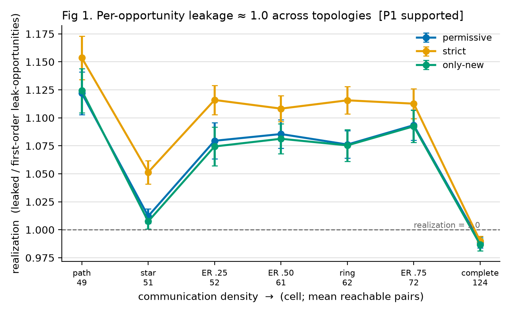
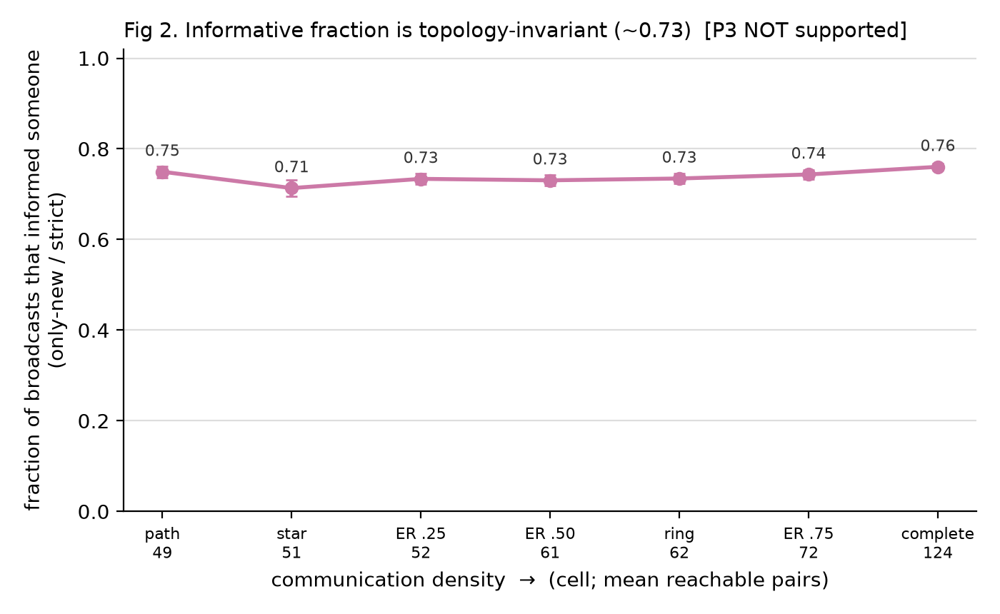
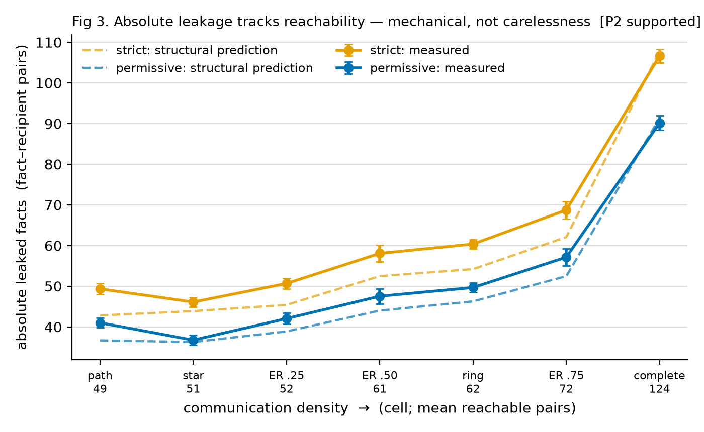
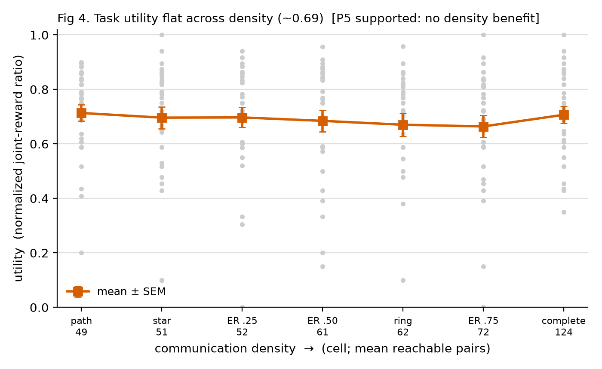

# Incidental Private-Information Leakage vs. Communication-Topology Density in a Cooperative Multi-Agent System

*Framing (question, method, the five predictions) was pre-registered before the 30-seed/cell
sweep; §4 reports results from `experiments/results/sweep_full.csv`, figures in `figures/`.
Predictions reported exactly as they landed: **P1 ✓, P2 ✓, P3 ✗, P4 ⚠ (mechanism corrected),
P5 ✓.** Built on [Terrarium](https://github.com/umass-aisec/Terrarium) (arXiv:2510.14312),
used unmodified as a dependency.*

---

## Abstract
We measure, in Terrarium's cooperative meeting-scheduling environment with **no adversary**, how
much private agent state incidentally reaches agents that have no task need for it, as a function
of communication-topology density. Holding the task instance (DCOP factor graph), model
(gpt-4.1-mini), and all environment parameters fixed, we vary only the communication topology
(path → ring → star → Erdős–Rényi → complete) across 30 published seeds. **Primary finding: a
null result — agents disclose essentially all *reachable* private state regardless of topology
(per-opportunity leakage ≈ 1.0 and per-broadcast information gain ≈ 0.73, both flat across every
cell); communication density governs only reachability, so absolute leakage scales ~2.2× from
path to complete as pure arithmetic, not carelessness, while task utility stays flat (~0.69).**
**Secondary finding: a small routing effect that is STRUCTURAL, not density-driven — private
state travels beyond the direct graph via relay (second-order-exclusive leakage ~4–5 facts/run in
path/ring/ER, but 0.67 in star and 0 in complete), scaling with the number of distinct relay
intermediaries a topology provides rather than its density (star, though sparse, funnels all
relay through one hub).** We also quantify LLM-judge prompt sensitivity: two reasonable phrasings
of the judge instruction differ by ~2–3 relay keys/run in sparse cells and are identical in dense.

## 1. Question
How much private information leaks incidentally between agents during ordinary cooperative
coordination, as a function of communication-topology density? This is a contextual-integrity /
need-to-know question, not an attack: no agent is instructed to elicit anything.

## 2. Why this is a gap
- Terrarium §4.2 states the blackboard topology is instantiated by a factor graph that
  "implicitly controls communication efficiency" and speculates that putting all agents on one
  blackboard may degrade performance (context bloat; *Lost in the Middle*) — but never tests it.
- The paper varies factor-graph initialization across seeds as *uncontrolled noise*, not as a
  studied variable.
- **Two-graphs distinction (our framing):** the DCOP *factor graph* (who *needs* to coordinate)
  and the *communication network* (who *can* talk) are independent knobs in the code, though
  §4.2 treats them as one. Holding the factor graph fixed and varying only the communication
  graph is what makes "leakage vs density" well-posed.

## 3. Method

### 3.1 Environment and what is actually private
Meeting-scheduling (CoLLAB v2). **The environment generates NO private valuations or priority
rankings** — a reader might assume otherwise, so we state it plainly: preferences are implicit,
deterministic, and identical in form for every agent. The genuinely private, agent-specific
state is *structural*: (a) which meetings an agent is in (title/window/roster), and (b) the
attendance **intervals** it chooses. We measure leakage of **participation-structure** and
**intervals**, and never call this "preference leakage."

### 3.2 Need-to-know, from the factor graph — three definitions
Two agents legitimately need to exchange interval information for meeting *m* iff they
co-participate in *m* and *m* is **soft** (the only multi-owner coordination factor). Strict
meetings are unary factors → zero cross-agent need. We score leakage under **three first-class
definitions**, each answering a distinct question. They are *nested* on participation
(only_new ⊆ permissive ⊆ strict) and identical on intervals:

| definition | question it answers | participation leak iff | interval leak iff |
|---|---|---|---|
| **permissive** | did info reach someone with **no task need**? | recipient is not a soft co-participant of *m* | recipient is not a soft co-participant of *m* |
| **strict** | was info **broadcast beyond the minimum**? | recipient ≠ owner (any exposure) | (same as permissive) |
| **strict-but-only-new** | did anyone **actually learn something they didn't have**? | recipient is not a participant of *m* (else they already hold the roster) | (same as permissive) |

Rationale: a recipient already holds `participation(X,m)` iff it is itself a participant of *m*
(its own instruction lists *m*'s full roster). Intervals are private choices no recipient holds
a priori, so all three agree on intervals. `strict − only_new = ` **redundant broadcasts** =
roster re-disclosures to co-participants who already know. `only_new / strict = ` **fraction of
broadcasts that actually informed someone** — our cleanest contextual-integrity signal.

### 3.3 Leakage detector (hybrid)
Deterministic need-to-know + blackboard parsing; an LLM judge (gpt-4.1-mini, T=0, grounded on
the meeting list) does the single semantic step of deciding which private facts a free-text
message discloses, scored full/partial/none = 100/50/0 (paper §6 scale). Structured
`attend_meeting` actions are extracted deterministically, not judged.
- **Action backstop (design property, not an estimate):** every action (incl. `skip`) is logged
  to the board, so *first-order* participation and attended intervals reach all board members
  regardless of the judge. This **bounds where judge error can occur** to *pre-execution
  intentions* and *second-order/relay* facts — the first-order bulk is judge-independent.
- **Accuracy filter (from the paper's own §6 scale, not invented):** a disclosure claiming
  "X takes part in meeting m" is scored only if X is *actually* a participant; an inaccurate
  claim scores 0 per §6. This validates the judge's text extraction against deterministic
  ground truth (the roster), which is what made the tightened co-mention rule **safe** — it
  catches "overlap with A and B" without letting a loosely-phrased over-mention inflate leakage
  with a meeting the named agent isn't in (verified: dense-graph leaked counts unchanged).
- **Recall (scoped):** on the runs audited (one dense, one path), permissive recall is robust;
  strict recall is sensitive to third-party co-mention detection and biased *downward*
  (conservative). See §5.1 prompt sensitivity.

### 3.4 Two exposure denominators
- **First-order reachable pairs:** (fact about X, recipient Y) where Y shares a board with X.
- **Relay-reachable pairs:** Y in X's connected component (info can reach Y via any relay hops).
  For a connected network this is ~everyone, so relay-realization is not comparable across
  topologies; its role is the *upper bracket* that keeps first-order realization > 1.0
  interpretable as "information traveled beyond direct reach via relay," not as an error.
Leakage is reported as (i) absolute leaked facts, (ii) leak rate = leaked/disclosed, and
(iii) realization = leaked/first-order-opportunities.

### 3.5 Design
7 topology cells (path, ring[Watts–Strogatz k=2,p=0 — constructed; Terrarium has no native ring],
star, Erdős–Rényi p∈{0.25,0.5,0.75}, complete), `consolidate_channels=true` throughout, 5 agents,
30 Appendix-B.2 seeds, one row per run. Utility = normalized joint-reward ratio (comparable to
paper Table 1).

### 3.6 Pre-registered predictions (recorded BEFORE sweep numbers exist)
Written in advance so the narrative is not fitted to the data:

- **P1 (null result).** Per-opportunity leakage (`realization`) is ≈ constant across all
  topologies for every definition; agents disclose essentially all reachable private state
  regardless of density.
- **P2 (mechanical absolute).** Absolute leaked facts rise monotonically with edge density,
  tracking the structural `reachable_fact_recipient_pairs` count roughly proportionally.
- **P3 (routing / information gain — the key new prediction).** `fraction_broadcasts_informative`
  (= only_new / strict) **decreases** with density: in dense topologies most roster broadcasts are
  **redundant** (recipients already hold the roster via their own participation), while in sparse
  topologies a larger fraction of broadcasts genuinely inform a recipient. Equivalently,
  `redundant_participation_broadcasts` grows super-linearly with density. If P3 holds it is a
  cleaner routing story than the relay-realization metric, because it measures *information gain*
  directly rather than reachability arithmetic.
- **P4 (relay, weaker prior).** First-order `realization` exceeds 1.0 only in sparse topologies,
  and second-order-exclusive leakage is > 0 in sparse and ≈ 0 in dense. Held with lower
  confidence (spot-check suggests it is largely a strict-definition effect).
- **P5 (utility).** Task utility does not increase with density (may be flat or noisy), testing
  the untested §4.2 speculation.

Each prediction will be reported as supported / not-supported against the 30-seed data, with
seed variance shown, regardless of outcome.

## 4. Results (n = 30 seeds/cell; error bars = SEM; Figs 1–4)

Prediction scorecard: **P1 ✓, P2 ✓, P3 ✗ (not supported), P4 ⚠ (effect real; stated *mechanism*
corrected — structural intermediary-count, not density), P5 ✓.**

| | |
|---|---|
|  |  |
|  |  |

### 4.1 HEADLINE 1 — the null result (leads) — **P1 SUPPORTED**
Per-opportunity leakage (`realization` = leaked / first-order opportunities) sits in a narrow
band across *every* topology: permissive **0.99–1.12**, strict **0.99–1.15**, only-new
**0.99–1.12** (Fig 1). It is ~1.0 everywhere — agents disclose essentially all reachable private
state regardless of density — with a slight excess >1.0 in the *sparse* cells (the relay signal,
§4.2) and exactly ~0.99 at `complete`. *(Why complete dips just under 1.0: with everyone on one
board, first-order reach already equals full reach, so no relay can push leaked above the
denominator — realization is capped at 1.0 by construction, and 0.99 just reflects a couple of
possible leaks that were never actually disclosed; every other cell has first-order reach < full,
so relay lifts it above 1.0.)* Sparser communication buys
exactly the privacy reachability arithmetic predicts, and **no behavioral discretion on top of
it**. This headline rests on the deterministic action backstop, not the judge.

### 4.2 HEADLINE 2 — relay routing — **P4 ⚠ MECHANISM CORRECTED**
Relay leakage is real: second-order-exclusive leakage (facts a recipient learns *only* via a
third-party relay) is permissive **~4.2–4.8 per run in path, ring, and the ER cells, but 0.67 in
star and 0.00 in `complete`**, and first-order realization exceeds 1.0 exactly in those same
cells (Fig 1). Private state does travel *beyond* the direct communication graph via relay.

**Correction to P4's stated mechanism (reported as an error, like P3's failure).** We
pre-registered P4 as relay being a *sparse* (density) effect — which predicts star (reach 51,
second-sparsest) should look like path (~4.6). It does not: star is **0.67**. Checking the logs
directly, the cause is **structural, not density**: relay in star is funneled through a single
hub (100% of relay events, 20/20; mean 0.37 distinct relayers/run — e.g. hub *Avery* relaying
`Riley's m003 participation → Quinn`), whereas path and ring distribute relay across ~2.2 distinct
intermediaries/run. In a star, leaves connect only to the hub, so a leaf can never relay another
leaf's fact — only the one hub can, one hop — while in path/ring/ER *every* agent is an
intermediary with distinct neighbors, so relay compounds along chains. The correct statement is:
**relay/second-order leakage scales with the number of DISTINCT relay intermediaries a topology
provides, not with its density.** Density and intermediary-multiplicity happen to correlate for
path/ring/ER; star breaks that correlation and reveals the true driver. P4-as-phrased was wrong
about the mechanism; we state that plainly rather than absorb star into a density story.

### 4.3 The routing prediction that failed — **P3 NOT SUPPORTED**
**P3 FAILED, and we report it as such.** We predicted `fraction_broadcasts_informative`
(= only_new / strict) would **decrease** with density (dense = mostly redundant roster
re-disclosure). It does **not**: the fraction is **flat at ~0.71–0.76** across all densities
(Fig 2; corr with density = **+0.68**, i.e. if anything slightly *up*, not down). Absolute
`redundant_participation_broadcasts` does rise with density (path ~12 → complete ~26), but so do
informative broadcasts, so the *ratio* stays constant. The failure is informative: it **extends
Headline 1** — not just per-opportunity leakage but per-broadcast *information gain* is
topology-invariant. The clean routing story we hoped for from P3 is not there; the routing
signal lives only in the smaller second-order-exclusive count.

### 4.4 Absolute vs. mechanical (stated plainly) — **P2 SUPPORTED**
Absolute leaked facts scale **~2.2× (strict: 49 → 107) / ~2.2× (permissive: 41 → 90) from path
to complete**, tracking the structural reachable-pair count almost exactly
(**corr(leaked_strict, reachable_pairs) = 0.994**, Fig 3 — measured overlays the structural
prediction). This is **arithmetic, not carelessness**: denser topologies create proportionally
more exposure opportunities and agents fill ~all of them. No reader should conclude denser MAS
are more careless — per-opportunity behavior is unchanged (§4.1).

### 4.5 Privacy / utility — **P5 SUPPORTED**
Task utility is **flat at ~0.66–0.71** across the whole density range (corr(utility, density) =
**0.12**; Fig 4, with wide per-seed scatter shown). Denser communication bought **no**
coordination benefit — a direct test of the paper's untested §4.2 speculation that a
fully-connected blackboard need not improve (and may degrade) performance: here it neither
helped nor hurt on the mean, while it strictly increased absolute leakage.

## 5. Limitations (specific)
- **One environment, one model, one task, 5 agents, 30 seeds** — not a general claim about MAS.
- **Incomplete runs are INCLUDED, with a per-cell completion-rate column (§4).** **8** runs
  finished (ok=True, no error) but left 1–3 of ~13–18 variables unassigned (~90%+ complete);
  per-cell completion rate: path/ER.75/complete 1.00, star/ring 0.97, ER.25/ER.50 0.90;
  seed er025/774005 under-coordinates at 16/18 regardless of reruns. We include all 30/cell
  rather than exclude these, because excluding them would select for *successful coordination*,
  and coordination difficulty may itself correlate with topology — so exclusion is a biased
  filter, not a clean one. Completion rate is reported per cell so the reader can judge.
- **LLM-judge metric** has its own error rate; it affects only *intentions* and *relay* facts
  (action backstop covers first-order). Judge co-mention recall is imperfect → **strict** leakage
  is a conservative *lower* bound; **permissive** is robust in audits.
- **Strict definition** counts re-disclosure of rosters recipients may already hold as
  co-participants; it is an upper-bound notion, not "new information learned."
- **Relay realization > 1** is definition-sensitive (largely strict in spot-check).
- **Reproducibility observations (fair, not criticisms):** the shipped default config targets
  `foundry`/`gpt-5.4-nano`, a provider most readers lack; Terrarium has no native `ring` (we
  constructed one via Watts–Strogatz k=2, p=0). Erdős–Rényi cells use the framework's channel
  connectivity bridging at low p, slightly inflating reachability.
- **No adversary** — this bounds *incidental* leakage only; says nothing about elicitation.

### 5.1 LLM-judge prompt sensitivity (short subsection, not a footnote)
Two reasonable phrasings of the *same* judge instruction — one that treats only directly
addressed agents as involved, and one that also treats agents named as overlap/coordination
targets — produced **measurably different relay-leak counts in sparse topologies and identical
counts in dense ones**. Per-cell original→re-judged **permissive leaked** delta: path +2.9,
ER.25 +2.4, ER.50 +2.6, ring +2.0, ER.75 +1.6, star +0.1, **complete −0.5** — ~2–3 keys/run in
sparse cells, statistically identical in dense ones. (Second-order-*any* shifts more, Δ+3…+12,
but that does not change leak totals in dense cells since a complete board already delivers every
fact to everyone.) This is not a bug in either phrasing; it is a property of LLM-as-judge
measurement that most papers do not quantify.
It matters here precisely because the relay/routing signal lives in sparse topologies — the
exact regime where the metric is most prompt-sensitive. We report BOTH number sets; the null
result (§4.1) is unaffected because it rests on the deterministic action backstop, not the judge.
The accuracy filter (§3.3, from the paper's §6 scale) is what let the higher-recall phrasing
stay precise; without it the tighter rule would have over-counted.

## 6. Conclusion
In this one environment/model/task, **incidental privacy in a cooperative MAS is governed by
reachability arithmetic, not by agent discretion**. Agents leak essentially all private state
that the communication topology makes reachable (per-opportunity leakage and per-broadcast
information gain are both topology-invariant), so sparser topologies are more private only in the
mechanical sense of exposing fewer recipients — and they buy that privacy at no measured utility
cost. The one genuinely topology-dependent effect is small: sparse structures *route* private
state beyond the direct graph via relay (second-order-exclusive leakage), which dense structures
do not. The pre-registered prediction that denser topologies would broadcast *proportionally*
more redundantly (P3) was **not supported** — that ratio is flat too, which only strengthens the
null. Finally, the relay signal is exactly where an LLM-judge metric is most sensitive to prompt
wording, and we quantify that sensitivity rather than hide it. None of this says "Terrarium is
insecure" or "MAS leak data"; it says *how much* incidental leakage varies with density, and the
answer is: in absolute terms proportionally, per-opportunity not at all.
